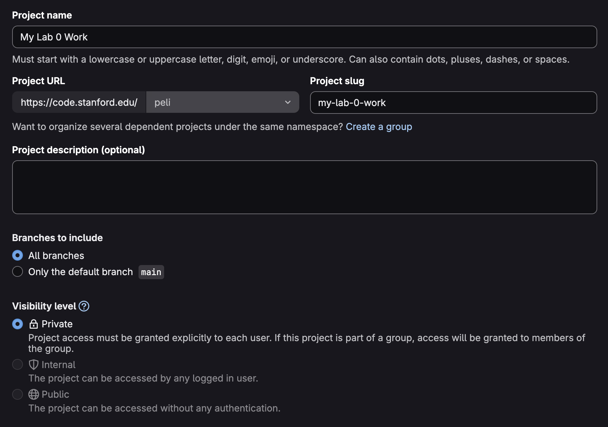

# Lab 0 - Getting started with Catapult HLS and AWS F2

This lab is designed to get you familiar with the High-Level Synthesis (HLS) design flow using Synopsys Catapult HLS tool and the AWS F2 FPGA development environment.
You will implement **a simple counter** in SystemC, generate RTL through HLS, simulate the design at various stages, and finally program and test the design on an AWS F2 FPGA instance.

**Access the starter code on https://code.stanford.edu/cs217/cs217-lab-0.git.**
Fork it to your own GitLab account first before cloning it to your working environment.

> Please note that this assignment takes substantial amounts of idle time -- about 30-40 minutes of build time -- so please get started as early as you can. 
> The same applies for all remaining lab assignments and projects in this course.

## Table of Contents

- [Lab 0 - Getting started with Catapult HLS and AWS F2](#lab-0---getting-started-with-catapult-hls-and-aws-f2)
  - [Table of Contents](#table-of-contents)
  - [Overview](#overview)
    - [Directory Structure](#directory-structure)
  - [Part 1: Setting Up FarmShare and Git for Catapult HLS](#part-1-setting-up-farmshare-and-git-for-catapult-hls)
    - [Setting up FarmShare Computing](#setting-up-farmshare-computing)
    - [Setting up Git](#setting-up-git)
  - [Part 2: Implementing and Simulating Counter in SystemC](#part-2-implementing-and-simulating-counter-in-systemc)
    - [Initial Setup on FarmShare](#initial-setup-on-farmshare)
    - [Implementing the Counter Module](#implementing-the-counter-module)
  - [Part 3: Generating RTL through HLS and Running RTL Simulation](#part-3-generating-rtl-through-hls-and-running-rtl-simulation)
  - [Part 4: Setting Up AWS F2 Instance](#part-4-setting-up-aws-f2-instance)
  - [Part 5: Hardware Simulation with AWS F2 Top](#part-5-hardware-simulation-with-aws-f2-top)
    - [Setting Up Project Environment](#setting-up-project-environment)
  - [Part 6: Bitstream generation, AFI generation, and Programming the F2 Instance](#part-6-bitstream-generation-afi-generation-and-programming-the-f2-instance)
    - [Generate Bitstream and AFI](#generate-bitstream-and-afi)
    - [Wait for AFI to be Available](#wait-for-afi-to-be-available)
    - [Program the F2 Instance](#program-the-f2-instance)
  - [Submission](#submission)
- [Appendix](#appendix)
  - [Connections Library: `Push`/`Pop` and Blocking vs. Non-Blocking](#connections-library-pushpop-and-blocking-vs-non-blocking)
    - [Blocking Calls: `Push(data)` and `Pop()`](#blocking-calls-pushdata-and-pop)
    - [Non-Blocking Calls: `PopNB(data)` and `PushNB(data)`](#non-blocking-calls-popnbdata-and-pushnbdata)
  - [Loop Unrolling Pragma](#loop-unrolling-pragma)
  - [Debugging](#debugging)

## Overview

In order to successfully program an FPGA accelerator, generally you will need to go through the following steps:

1. Design the SystemC model of the accelerator, write a functional testbench in C++, and simulate it to verify correctness.
2. Run Catapult HLS to generate behavioral RTL code from the SystemC design. The generated RTL is then simulated against the same C++ testbench to verify correctness in the Synopsys VCS simulator.
3. Copy the behavioral RTL code to the AWS F2 design environment and simulate it against a new RTL wrapper testbench that more closely approximates the real FPGA environment.
4. Generate the FPGA bitstream using Vivado, create an Amazon FPGA Image (AFI), and program the AWS F2 FPGA instance with the AFI.
5. Write a third testbench that directly interfaces with the FPGA in C++, and run it on the programmed FPGA to verify end-to-end functionality.

If you are keeping track, there are three different representations of your hardware design (SystemC, behavioral RTL, and FPGA bitstream) and three different testbenches (SystemC testbench, RTL wrapper testbench, and FPGA host-side testbench) throughout this process.
For many of the early lab assignments, you will only need to write code for the SystemC design. 
The three testbenches as well as the compilation flow from SystemC to RTL to FPGA bitstream are provided for you.


### Directory Structure 

* `src`: Contains the SystemC design files for the HLS (High-Level Synthesis) accelerator model. This is where the core design is implemented.
  * `counter_top`: This subdirectory holds the source code for the example design.
    * `counter_top.h`: The main header file for the SystemC module.
    * `counter_module.h`: A header file for a submodule of the counter.
    * `add.h`: A header file for an adder module that increments the counter value by a fixed value.
    * `testbench.cpp`: The testbench for simulating the SystemC design to verify its functionality before synthesis.
    * `Makefile`: Makefile for compiling and running the SystemC simulation.
* `hls`: This directory is the workspace for the Catapult HLS tool. It contains the generated RTL (Register Transfer Language) files after synthesizing the SystemC design.
* `counter`: Holds all the necessary files for the AWS F2 FPGA implementation.
  * `design`: Contains the Verilog/SystemVerilog wrapper files that instantiate the HLS-generated core and connect it to the AWS shell interfaces.
  * `build`: Includes scripts required for building the design checkpoint for the AWS F2 instance.
  * `software`: Contains the host-side C code that interacts with the FPGA. This includes code to send data to, receive data from, and control the accelerator.
  * `verif`: The verification environment for the FPGA design, including testbenches and simulation scripts.
* `scripts`: A collection of helper scripts for automating various tasks, such as setting up the environment, running simulations, and creating AWS S3 buckets.
* `docs`: Contains supplementary documentation, such as the guide for using VSCode with the development environment.

## Part 1: Setting Up FarmShare and Git for Catapult HLS

### Setting up FarmShare Computing

For designing in system C using Catapult HLS, you will be working FarmShare OnDemand Desktop.

First, you need to log into the FarmShare machine and create a desktop node.
Notice you do not have to be on the Stanford network for any of these steps.

1. You need to log in to the following machine to set up your account: `ssh <SUNetID>@login.farmshare.stanford.edu`. Note that for this step, you only need to do it once and from your local machine. From there, your account will exist.
2. Create a desktop instance on https://ondemand.farmshare.stanford.edu by selecting Interactive Apps pull down menu and FarmShare Desktop, and then click “Launch”. In a few seconds, your session will be complete.
3. From now on, you can open the desktop by clicking “Launch FarmShare Desktop”. You should see a browser tab open up showing an xfce4 desktop shell. Click the bottom-left terminal icon (Or “Applications” -> “Terminal Emulator”). You will perform most tasks in the terminal. For more details, please refer to https://ee.stanford.edu/student-resources/it-resources/ee-instructional-computing-resources.
4. You can also connect to your FarmShare working directory through [Visual Studio Code](https://code.visualstudio.com/), a guide which for that is attached at `docs/UsingVSCode.md`.
5. For more information on FarmShare, please refer to [its documentation site](https://docs.farmshare.stanford.edu/). 

### Setting up Git

This course uses Stanford's self-hosted GitLab instance, [code.stanford.edu](https://code.stanford.edu/), for version control and code hosting.
Follow the steps below to set up your Git environment and fork the lab repository to track your progress.

1. [Set up your personal access token or local host ssh key on code.stanford.edu](https://code.stanford.edu/-/user_settings/ssh_keys) -- refer to [GitLab's documentation](https://docs.gitlab.com/user/ssh/) for help if needed.
2. Navigate to the lab project's repository, https://code.stanford.edu/cs217/lab-0, and fork the repository to your own GitLab account by clicking the "Fork" button in the top-right corner of the page.
3. Under "Project URL," you will need to select your SUNetID as the namespace to fork the repository into your own account. Select a descriptive project name, such as "lab-0".
4. **You must also set the visibility level to "Private"**. You can later [add collaborators](https://docs.gitlab.com/user/project/members/#add-users-to-a-project) to your forked repository if needed.



## Part 2: Implementing and Simulating Counter in SystemC

The first step is to implement the counter module in SystemC and simulate it to verify correctness.
This would be a functional model of the design that is independent of any hardware considerations.

### Initial Setup on FarmShare

On the FarmShare computing environment, clone your forked lab 0 repository from Gitlab. Make sure to replace `[namespace]` and `[repo name]` with your actual SUNetID and the name of your forked repository.

```bash
git clone git@code.stanford.edu:[namespace]/[repo name].git
cd [repo name]
```

Run the following command from the current terminal to setup the CAD development environment and source the setup script for Catapult HLS.
You will need to run this command every time you open a new terminal for all assignments in this course.

```bash
# launch the cad environment
/farmshare/home/classes/ee/admin/software/bin/rhel8.sh
# then navigate to the lab repository
cd [repo name]
source setup.csh
```

### Implementing the Counter Module

Navigate to the `src/counter_top` folder. 
You will be implementing a small counter module in `counter_module.h` and an adder module that increments the counter value by a fixed value in `add.h`. 
Complete all the TODOs in these two files as per the specifications mentioned in the comments.
This is a small exercise to get your familiar with ready valid interface that HLS uses. A small appendix for your reference is added at the end of this specification document.

Run the following commands to test a simple counter.

```bash
# From the lab0 repo top
cd src/counter_top/
# Compile the system C files
make clean
make sim_test

# Run the testbench.cpp
make run
```

Alternatively this can also be done from repo top through the following make command - `make systemc_sim`.
Make sure that all the tests in the SystemC simulation passes and you see "Test PASSED" printed on the standard output before moving to the next step.

> If you are keeping track, here are the design and testbench files used so far:
> - Source files: (all in SystemC)
>    - `src/counter_top/counter_top.h`
>    - `src/counter_top/counter_module.h` (your implementation)
>    - `src/counter_top/add.h` (your implementation)
> - Testbench file: `src/counter_top/testbench.cpp` (SystemC testbench)
> - Build artifacts: `src/counter_top/sim_test` (C++ executable)


## Part 3: Generating RTL through HLS and Running RTL Simulation

The next step is to use Catapult HLS to generate register-transfer level (RTL) code from the SystemC design and run RTL simulation to verify the generated design.
This process might take more than 5-10 minutes to complete, so please budget your time accordingly.

```bash
# Navigate to the hls directory
cd hls/counter_top/

# Clear previous builds
make clean
# Generate RTL and run VCS simulation
make hls
```

In the likely case that there are errors during synthesis or simulation, inspect the `hls/counter_top/catapult.log` file for any potential errors or warnings.
Modify your SystemC code accordingly and re-run the above commands until you get a successful simulation.

If your SystemC is correct in terms of being "synthesizable" and able to be mapped to real logical circuits, Catapult HLS will generate the RTL code and simulate it against the same testbench used in the SystemC simulation.
If you see the same "Test PASSED" message printed on the standard output, then your design is correct.

The generated RTL file for the counter design will be located at `hls/counter_top/Catapult/counter_top.v1/concat_counter_top.v` -- the file name indicates that it is a concatenated RTL file that includes all necessary dependencies for the top-level module.
We can now copy this file to the working directory for the AWS F2 instance as follows:

```bash
cp $HLS_HOME/counter_top/Catapult/counter_top.v1/concat_counter_top.v $AWS_HOME/design/

# Alternatively, from the repo top
cd [repo name]
make rtl_copy
```

Commit your changes to your forked repository before moving on to the next step, since you will be switching from the HLS design environment on FarmShare to the AWS F2 FPGA environment.
You may need to tweak the `.gitignore` file to make sure the relevant files are committed.

> If you are keeping track, here are the design and testbench files used so far:
> - Source files: `hls/counter_top/Catapult/counter_top.v1/concat_counter_top.v` (generated RTL)
> - Testbench file: `hls/counter_top/testbench.cpp` (same SystemC testbench as before)
> - Build artifacts: `hls/counter_top/Catapult` (directory containing generated RTL and simulation files)

## Part 4: Setting Up AWS F2 Instance

Configuring the AWS F2 instance involves several steps including setting up an S3 bucket for storing FPGA images, configuring the FPGA development environment, and installing necessary packages.
Please setup the AWS F2 instance as per [AwsInstanceSetup.md](docs/AwsInstanceSetup.md) first and then continue the steps here.

Clone the your forked lab 0 repository from Gitlab on the AWS F2 instance. Make sure to replace `[namespace]` and `[repo name]` with your actual SUNetID and the name of your forked repository. 
You may also need to set up your SSH keys on the AWS instance to be able to clone through SSH.
Then install the required packages through the provided script.

```bash
git clone https://code.stanford.edu/[namespace]/[repo name].git
cd [repo name]
source scripts/aws/install_pkg.sh
```

Manually resolve any dependency issues that arise during the installation.
You should see the following printed to the standard output at the end of the installation:

```log
INFO: AWS HDK setup PASSED
...
INFO: sdk_setup.sh PASSED
```

You should only have to run the `install_pkg.sh` script once on the AWS F2 instance.

## Part 5: Hardware Simulation with AWS F2 Top

The next step is to simulate the RTL code generated by HLS in the AWS F2 environment on a second RTL testbench that more closely approximates the real FPGA environment.

### Setting Up Project Environment

First set up the AWS FPGA environment.
You will need to run these commands every time you open a new terminal on the AWS F2 instance.

```bash
# Source the AWS FPGA setup scripts
cd ~/aws-fpga
source hdk_setup.sh
source sdk_setup.sh
# Copy the required counter folder to aws hdk space
cp -r <Lab 0 repo top>/counter/ ~/aws-fpga/hdk/cl/examples/
cd ~/aws-fpga/hdk/cl/examples/counter
source setup.sh
```

Then run the following command to run hardware simulation with the AWS F2 top-level design.

```bash
make hw_sim
# The testbench should print "PASS" on standard output
```

> If you are keeping track, here are the design and testbench files used so far:
> - Source files: `counter/design/concat_counter_top.v` (HLS-generated RTL copied to AWS F2 environment)
> - Testbench file: `counter/verif/tests/counter_base_test.sv` (RTL wrapper testbench)

<!-- Check the `design` folder. 
Check out all the design collaterals: `counter.sv` is the top file in which the HLS-generated design top is instantiated along with other FPGA interfaces for communication. 
For hardware simulation, this `counter.sv` is the new top, and the testbench is present at `verif/tests/counter_base_test.sv`. 

Run hardware simulation with `make hw_sim` and make sure the testbench prints "PASS" before moving on to the next step. -->

## Part 6: Bitstream generation, AFI generation, and Programming the F2 Instance

### Generate Bitstream and AFI

Run the following commands in order to generate the bitstream, create the AFI image, and program the F2 instance.

```bash
# Create the FPGA bitstream, this may take 12-15 minutes
make fpga_build
# Then generate the AFI image
make generate_afi
```

The `make fpga_build` command would invoke Vivado to synthesize the behavioral RTL code in `counter/design/concat_counter_top.v`, perform the necessary optimizations and place-and-route, and finally generate the FPGA bitstream.
If you have taken EE272 and/or designed ASICs before, this process would actually look much simpler with FPGAs than with ASICs.

The execution of the above script prints the AFI and AGFI IDs, and the standard output looks like below after AFI generation is complete:

```log
upload: build/checkpoints/[timestamp].Developer_CL.tar to s3://[bucket name]/cs217_labs/[timestamp].Developer_CL.tar
{ "FpgaImageId": "afi-0afb85865f373f861", "FpgaImageGlobalId": "agfi-001f507ef65fd416a" }
AFI is set to: afi-0afb85865f373f861
AGFI is set to: agfi-001f507ef65fd416a
```

The bitstream collaterals generated by Vivado are located in `~/aws-fpga/hdk/cl/examples/counter/build/checkpoints/`. 
If you are familiar with Vivado's command-line interface, you can open the checkpoints through Vivado to inspect the generated design.

```bash
vivado -mode tcl
open_checkpoint build/checkpoints/[checkpoint name].dcp
```

### Wait for AFI to be Available

Check if AFI is available for use by running the following.

```bash
make check_afi_available
```

The code field will show pending initially:
```json
"State": {
    "Code": "pending"
},
```

Rerun the command until after the "State" field shows "available", we can now load the image on the F2 instance and start running.

### Program the F2 Instance

Run the following commands to program the F2 instance with the generated AFI image.
<!-- We need a separate software script to test the actual FPGA design (instead of the SystemC or RTL simulation testbenches run earlier).
This is located at `counter/software/src/counter.c`.
The FPGA counter output is read back through an AXI interface and verified against expected values. -->

```bash
# Program the F2 instance
make program_fpga
# Run the software test
make run_fpga_test
```

The software test should print "TEST PASSED" on the standard output if everything is working correctly.

> If you are keeping track, here are the design and testbench files used so far:
> - Source files: `counter/design/concat_counter_top.v` (HLS-generated RTL copied to AWS F2 environment)
> - Testbench file: `counter/software/src/counter.c` (FPGA host-side interface testbench)
> - Build artifacts: `counter/build/checkpoints/` (directory containing Vivado build artifacts)

## Submission

This assignment requires two submission items: a writeup document and a zipped folder of your code.
Submit both to the [CS217 Gradescope](https://www.gradescope.com/courses/1209616).
The submission pages will be available in the upcoming days.

### Writeup

In the writeup, submit a screenshot of the following tests:

1. System C Simulation
2. RTL Simulation
3. AWS F2 Hardware Simulation
4. FPGA Test

#### Generative AI Usage

In the writeup, please also document how you may have utilized generative AI tools (e.g. ChatGPT/Codex, Gemini, Claude, Cursor, etc.) when completing this lab assignment.
Specifically include the following details:

1. What tools and/or workflows did you use?
2. How have you prompted the generative AI tools? What kind of context did you provide them with?
3. What worked well and what didn't?
4. What are your perceived productivitiy gains from utilizing generative AI tools?

### Code Submission

For the code submission, submit the `lab0-submission.zip` generated by `make submission`. Make sure the following files have the correct implementation / they exist:

1. `src/counter_top/counter_module.h`
2. `src/counter_top/add.h`
3. `counter/design/concat_counter_top.v`


# Appendix

Some useful documentation beyond what is provided here can be found on the Canvas "File" page, or under the following directory on the FarmShare CAD machine: `/cad/mentor/2024.2_1/Mgc_home/shared/pdfdocs`.
This should be your first point of reference for any questions regarding Catapult HLS or the Connections library throughout the course.
Specifically, the following files may be of interest for this lab:

- `connections-guide.pdf`: Documentation for the Connections library including detailed information on `Push`/`Pop` semantics and coding best practices.
- `catapult_useref.pdf`: User reference manual for Catapult HLS including pragmas and synthesis directives. Specifically Page 1440 contains a further discussion of the unrolling pragma.
- `hls_bluebook.pdf`: Tutorial-like introduction to HLS concepts and coding styles that you can work through at your own pace.

## Connections Library: `Push`/`Pop` and Blocking vs. Non-Blocking

We utilize the `Connections` library, a component of Catapult HLS [originally developed by NVIDIA research](https://github.com/hlslibs/matchlib_connections), to model communication between hardware modules. 
Understanding its `Push` and `Pop` mechanisms is crucial.

### Blocking Calls: `Push(data)` and `Pop()`

- **`Push(data)`**: This is a **blocking** write. The simulation will not advance past this call until the receiving module is ready to accept the data. In hardware, this corresponds to a valid/ready handshake, where the sending module asserts a `valid` signal and waits for the receiving module to assert a `ready` signal.
- **`Pop()`**: This is a **blocking** read. The simulation will not advance past this call until there is new data available from the sending module. It waits for the `valid` signal to be asserted by the sender.

Blocking calls are useful for modeling synchronous data transfers where sender and receiver must wait for each other. 
They simplify the control logic in C++ but can lead to simulation deadlocks if one side is waiting for a condition that never occurs.

### Non-Blocking Calls: `PopNB(data)` and `PushNB(data)`

- **`PopNB(data)`**: This is a **non-blocking** read. It attempts to read data from the channel *without* waiting.
    - It returns `true` if the read was successful (i.e., new data was available).
    - It returns `false` if no new data was available.

Non-blocking calls are used when a module needs to perform other work while waiting for data or when it needs to poll multiple sources.
At each clock cycle, one single non-blocking call would be made, and the module would not stall even if the push or pop was unsuccessful.

The standard coding pattern for non-blocking operations looks like this:

```cpp
DataType data_register;
Connections::In<DataType> input_channel("input_channel");
Connections::Out<DataType> output_channel("output_channel");

// Non-blocking pop example
if (input_channel.PopNB(data_register)) {
  // This conditional branch executes if the pop was successful
  // and new data is now in data_register
} else {
  // This branch executes if no new data was available
  // and data_register remains unchanged
}

// Non-blocking push example
if (output_channel.PushNB(data_register)) {
  // This branch executes if the push was successful
} else {
  // This branch executes if the output channel was not ready
  // and data_register was not sent
}
```

## Loop Unrolling Pragma

Loop unrolling is a technique that transforms the serial iterations of a loop body into individual code units allowing them to execute in parallel whenever possible. 
It is controlled by applying the `#pragma hls_unroll` directive to some or all of the loops in your design.  

Setting `#pragma hls_unroll yes` would **fully unroll** a loop such that a separate copy of hardware components is created for each iteration of the loop, instead of reusing the same hardware for each iteration.
This means that each iteration of the loop can execute simultaneously, leading to potentially significant latency improvements at the cost of increased area.
It is typically used on small loops where the iterations are independent and can be executed simultaneously. For example, loops that iterate over the `N_PE` (Number of Processing Elements) are unrolled in this project to create parallel hardware for each PE.

In later projects you may only want to partially unroll loops, which can be done by specifying an unrolling factor like this: `#pragma hls_unroll [unrolling factor]`.
For instance, `#pragma hls_unroll 4` would create 4 copies of the loop body, such that each clock cycle executes 4 iterations of the loop in parallel.

## Debugging

Debugging designs at the SystemC simulation level can be done using standard C++ debugging techniques including gdb. A common and straightforward method is to use standard output streams.

Insert `std::cout` statements into your C++/SystemC code to print values of variables, progress through code paths, or indicate specific events. These statements will be printed to the console during simulation, providing visibility into the design's behavior.

However, printing to standard out and other C++ debugging tools will not work in the generated RTL code or during hardware simulation on the FPGA level.
