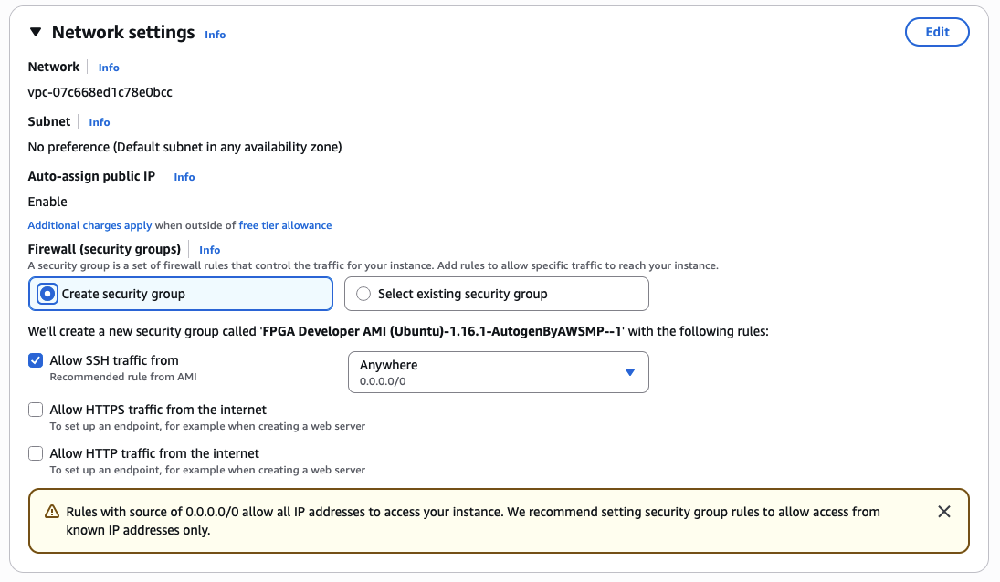
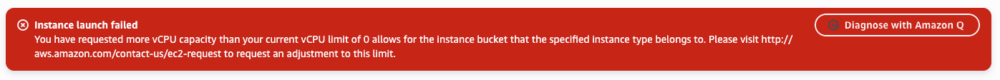
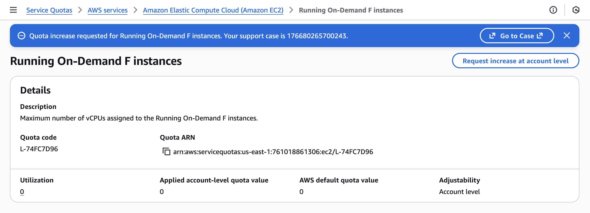
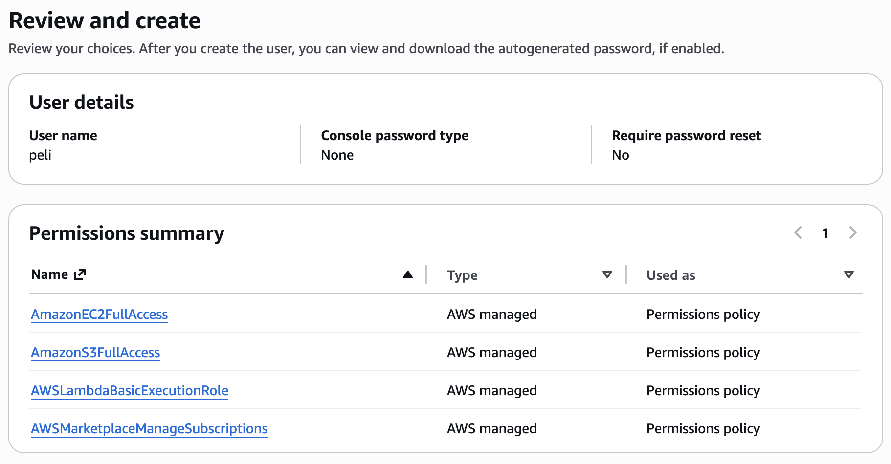

# AWS Instance Setup

## Table of Contents
- [AWS Instance Setup](#aws-instance-setup)
  - [Table of Contents](#table-of-contents)
  - [AWS Organization Setup](#aws-organization-setup)
  - [Creating the instance](#creating-the-instance)
    - [Troubleshooting Service Quota Issues](#troubleshooting-service-quota-issues)
  - [Connecting to the instance](#connecting-to-the-instance)
    - [Get the instance address](#get-the-instance-address)
    - [SSH into your instance](#ssh-into-your-instance)
      - [Option 1: Terminal](#option-1-terminal)
      - [Option 2: VSCode](#option-2-vscode)
  - [Configure AWS CLI and IAM User](#configure-aws-cli-and-iam-user)
    - [New user](#new-user)
    - [Configure IAM user access key](#configure-iam-user-access-key)
  - [Create S3 bucket](#create-s3-bucket)
  - [Stopping Instance](#stopping-instance)
  - [Creating an Alarm](#creating-an-alarm)

## AWS Organization Setup

Please make sure you are enrolled in this course and have access to the Canvas course website.
If you did, you should have received an email from AWS at your Stanford email address with instructions to create an AWS account to join this course's AWS Organization.

If you have not received this email, or if you are having trouble joining the AWS Organization, please fill out this form: https://forms.gle/VBCAnwgjbAu87Fgw6.

## Creating the instance

1. Login to your AWS account with the credentials you have used to create them and navigate to the EC2 dashboard with regions as us-east-1 , United States (N. Virginia). 
<div style="padding-left: 0px; padding-bottom: 30px; text-align: center;">
        
    </div>
2. Click "Launch Instance"
<div style="padding-left: 0px; padding-bottom: 30px; text-align: center;">
        
    </div>
3. Create a name for your instance - feel free to use your SUNet ID as well
<div style="padding-left: 0px; padding-bottom: 30px; text-align: center;">
        
    </div>
4. Click on `Browse more AMIs` AMI after selecting Ubuntu
<div style="padding-left: 0px; padding-bottom: 30px; text-align: center;">
        
    </div>
5. search for `FPGA Developer AMI` and select the `Ver 1.16.1` version, select `subscribe on instance launch` and confirm changes 
<div style="padding-left: 0px; padding-bottom: 30px; text-align: center;">
        
    </div>
6. Select instance type as `f2.6xlarge` and create a new key pair for your instance with `key pair name` of your choice and save it locally preferably to the `.ssh` folder
<div style="padding-left: 0px; padding-bottom: 30px; text-align: center;">
        
    </div>

<div style="padding-left: 0px; padding-bottom: 30px; text-align: center;">
        
    </div>
7. Select the security group or create a new one that allows for SSH access from any IP address


8. Launch the instance and click on the instance id link
    <div style="padding-left: 0px; padding-bottom: 30px; text-align: center;">
            
        </div>
    <div style="padding-left: 0px; padding-bottom: 30px; text-align: center;">
            
        </div>

### Troubleshooting Service Quota Issues

> This should not be an issue if your AWS account is part of the course AWS Organization. If you are using a personal AWS account, please follow these steps.

If you encounter an error related to usage quotas for vCPUs when launching the instance, you may need to request a quota increase from AWS support.



Navigate to the AWS Service Quota page for [Running On-Demand F instances](https://us-east-1.console.aws.amazon.com/servicequotas/home/services/ec2/quotas/L-74FC7D96) for the us-east-1 region.
Click on the "Request increase at account level" button and fill out the form to request an increase in the vCPU limit for F instances to at least 24 vCPUs.



Monitor your email for a response from AWS support regarding your quota increase request. Once approved, you should be able to launch the f2.6xlarge instance without encountering the vCPU quota error.

## Connecting to the instance

### Get the instance address

Navigate to the instance summary page and click on the `Connect` button.
    <div style="padding-left: 0px; padding-top: 0px; text-align: center;">
        
    </div>

Move to the 'SSH Client' tab and copy the address shown in the boxed field in this picture. This address changes whenever you start the instance. 
    <div style="padding-left: 0px; padding-top: 10px; padding-bottom: 30px; text-align: center;">
        
    </div>

### SSH into your instance

We primarily recommend directly connecting to your instance using a terminal and SSH with X11 forwarding enabled. This will allow you to run GUI applications on your instance, e.g., to review simulation reports.
If you are not familiar with terminal-based text editors like vim or nano, we recommend using VSCode to connect to your instance when editing source files.

#### Option 1: Terminal

The value in the SSH command after the `-i` option is the location of the private key. 
Include the `-XY` flag to enable X11 forwarding for GUI applications.

Replace `[Instance ID]` with the actual instance ID or public DNS of your AWS instance that you copied earlier.
Replace `[key name]` with the name of your private key file (without the `.pem` extension).

```
ssh -XY -i ~/.ssh/[key name].pem ubuntu@ec2-[Instance ID].compute-1.amazonaws.com
``` 

#### Option 2: VSCode

Install the 'remote-ssh' extension for VSCode. 
Press the small button on the lower right and select **Connect to host > Configure SSH Hosts** and choose the first file (this will look something like `\user\$USERNAME\.ssh\config`).
<div style="padding-left: 0px; padding-bottom: 30px; text-align: center;">
   
</div>

Add the following entry to the file and save it. The value for `HostName` is the address you copied in step 5. **This address changes whenever you start the instance. So you will have to update this field whenever you stop and re-start the instance.** The 'IdentityFile' field is the location where you saved the private key pem file earlier. 

```ini
Host aws_cs217
HostName [Instance ID].compute-1.amazonaws.com
IdentityFile "~/.ssh/[key name].pem"
User ubuntu
```

Selecting the newly added AWS host for remote SSH will connect you to your instance. Once you're connected, you can open folders in your instance using the 'File > Open Folder' feature and run code using the 'Terminal > New Terminal' feature.

## Configure AWS CLI and IAM User

To be able to create and upload the Amazon FPGA image (AFI), you need to configure an IAM (Identity and Access Management) user with the appropriate permissions and set up AWS CLI on your instance. 
Navigate to https://us-east-1.console.aws.amazon.com/iam/home?region=us-east-1#/users.
Create a new user or use an existing user with the required permissions.

### New user

On the IAM Users dashboard, click on "Create user" on the top right corner.

If there is no user created already, please follow the steps below to create a new user with the required permissions. If a user already exists, please skip to step 1 under [AWS Configure](#aws-configure).

1. In the "Specify user details" page, create a new user name of your choice
2. In the "Set permissions" page, select "Attach policies directly" and attach the following policies to the new user:
   - `AmazonEC2FullAccess`
   - `AmazonS3FullAccess`
   - `AWSLambdaBasicExecutionRole`
   - `AWSMarketplaceManageSubscriptions`
3. The next page should be populated with the following details:


### Configure IAM user access key

Navigate to the "Users" section in the IAM dashboard and select the user you created or an existing user with the required permissions. Please check the that the following permissions exist.


Create an access key with the the following settings


You can "Set description tag" if you want and proceed with "Create Access Key"


Make a note of the "Access Key" and "Secret Access key". You can only view this once, so please download the .csv file and store it securely. Do not commit the keys to your source code repository.


On your instance, configure the aws settings `aws configure`. Set your credentials, region, and output format. If you run the following command, it will ask you for Access Key ID and Secret Access Key, For the region, write 'us-east-1' and for the output write `json`

```
aws configure
```

The result should look like:
```
[centos@ip-172-31-21-2 src]$ aws configure
AWS Access Key ID [None]: <Your Access Key>
AWS Secret Access Key [None]: <Your Secret Access Key>
Default region name [None]: us-east-1
Default output format [None]: json
```

## Create S3 bucket 

S3 Bucket is used to upload and store the generated Amazon FPGA image (AFI). Please follow the steps below to create the S3 bucket.

1. Add the following to the bashrc (`~/.bashrc`) and open a new terminal or run `source ~/.bashrc`
```
export DCP_BUCKET_NAME=<SUNetID>
export DCP_FOLDER_NAME=cs217_labs
export REGION=us-east-1
export LOGS_FOLDER_NAME=logs_folder
export LOGS_BUCKET_NAME=$DCP_BUCKET_NAME
```
2. Run the following commands. If your chosen DCP_BUCKET_NAME gives you an error in creating the S3 bucket, use any unique ID.
```
# Create an S3 bucket (choose a unique bucket name)
aws s3 mb s3://${DCP_BUCKET_NAME} --region ${REGION}

# Create a folder for your tarball files
aws s3 mb s3://${DCP_BUCKET_NAME}/${DCP_FOLDER_NAME}/

# Create a folder to keep your logs
aws s3 mb s3://${LOGS_BUCKET_NAME}/${LOGS_FOLDER_NAME}/ --region ${REGION}

# Create a temp file
touch LOGS_FILES_GO_HERE.txt

# Create the folder on S3
aws s3 cp LOGS_FILES_GO_HERE.txt s3://${LOGS_BUCKET_NAME}/${LOGS_FOLDER_NAME}/
```

## Stopping Instance
The credits are used based on the number of hours the instance is run. Always turn off the instance once you are done
1. To the stop the instance navigate to the EC2 > Instances. Clock "stop intance" nder the "Instance State' drop down. It will take sometime for the instance to shut down. 
    <div style="padding-left: 0px; padding-bottom: 30px; text-align: center;">
            
    </div>
    <div style="padding-left: 0px; padding-bottom: 30px; text-align: center;">
        
    </div>
2. You can also stop it by running the following command on the terminal `sudo shutdown -h now`

## Creating an Alarm 
Please create an alarm for the instance so that it stops once the instance has been unintentionally not turned off. However, please always manually stop the instnace. 
1. Create the alarm and configure the settings as shown 
    <div style="padding-left: 0px; padding-bottom: 30px; text-align: center;">
            
    </div>
    <div style="padding-left: 0px; padding-bottom: 30px; text-align: center;">
        
    </div>
2. Scroll down and select "Create"
