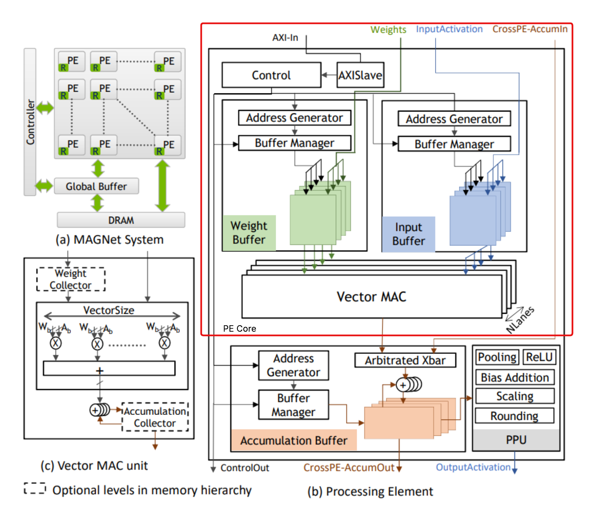

# Lab 1: Designing and Analyzing a Hardware Accelerator Processing Element (PE)

> The most important part of any lab assignment is to **start early**! Runtimes for the many simulation and synthesis steps can be up to 10 hours combined, so please plan accordingly.
> Please refer to the provided resources, and ask questions on EdStem or during office hours when you get stuck.

> Please read through this entire README before starting the lab.

## Table of Contents

- [Table of Contents](#table-of-contents)
- [1. Introduction and Objectives](#1-introduction-and-objectives)
  - [File Structure](#file-structure)
- [2. PE Core Architecture Overview](#2-pe-core-architecture-overview)
  - [The Processing Element (PE) Core](#the-processing-element-pe-core)
- [3. HLS to RTL design of the PE Core](#3-hls-to-rtl-design-of-the-pe-core)
  - [Task 1: Design and Verify the Processing Element](#task-1-design-and-verify-the-processing-element)
  - [Task 2: Find the Optimal Scale and Right Shift Values](#task-2-find-the-optimal-scale-and-right-shift-values)
  - [Task 3: Make sure that SystemC simulation for all parameterizations](#task-3-make-sure-that-systemc-simulation-for-all-parameterizations)
  - [Task 4: Generate RTL (HLS-\>RTL) and simulate RTL for the default values](#task-4-generate-rtl-hls-rtl-and-simulate-rtl-for-the-default-values)
  - [Task 5: Generate RTL, Simulate RTL and Report Area for All Design Points](#task-5-generate-rtl-simulate-rtl-and-report-area-for-all-design-points)
- [4. RTL to F2 implementation of the PE Core](#4-rtl-to-f2-implementation-of-the-pe-core)
  - [Task 6: Runtime Profiling on AWS F2 Hardware Simulation](#task-6-runtime-profiling-on-aws-f2-hardware-simulation)
  - [Task 7: Running the PE Core design on FPGA](#task-7-running-the-pe-core-design-on-fpga)
- [5. Extra Credit](#5-extra-credit)
- [6. Submissions](#6-submissions)
  - [Writeup Submission](#writeup-submission)
  - [Code Submission](#code-submission)
- [7. References](#7-references)
- [Appendix](#appendix)

## 1. Introduction and Objectives

Modern computing demands are increasingly addressed by specialized **hardware accelerators** designed to significantly boost performance and energy efficiency for critical workloads like Deep Learning, signal processing, and scientific computation. The fundamental building block of these accelerators is the **Processing Element (PE)** that performs the core arithmetic operations, typically multiply-accumulate (MAC) functions, on streams of data.

This lab assignment provides a hands-on experience in the complete hardware development flow, from high-level modeling to deployment on a cloud Field-Programmable Gate Array (FPGA) platform. You will design, model, and analyze the core PE functionality, ultimately implementing it on an **AWS F2** instance.

The core objectives of this assignment are:

* **Design and Modeling:** To design the PE core using **SystemC**, leveraging its capabilities for accurate hardware description and modeling at the Register-Transfer Level (RTL).
* **Trade-off Analysis:** To understand and quantify the crucial **area-performance trade-offs** inherent in hardware design. You will explore how architectural choices, such as vector lanes and data width, impact the required silicon area (measured in resources like LUTs and FFs) versus the achievable clock frequency and throughput.
* **FPGA Implementation:** To utilize a High-Level Synthesis (HLS) flow to convert the SystemC design into synthesizable Verilog/VHDL RTL and implement it on the specialized FPGA resources of an **AWS F2** cloud instance.
* **System-Level Performance:** To critically analyze the **overall execution time** of the accelerated task. This involves breaking down the total time into two components: the time spent **transferring data** between the host CPU and the FPGA over the high-speed PCIe bus ($\Delta T_{transfer}$) and the time spent on the **actual computation** within the PE core ($\Delta T_{comp}$). This analysis will reveal the importance of the communication overhead and when an accelerator truly yields a performance benefit.

By the end of this lab, you will not only have a working hardware accelerator component but also a deep understanding of the practical limitations and performance considerations required for real-world accelerator deployment. 

### File Structure

- `src/`: SystemC source code for the PE Core and supporting modules.
  - `src/include/`: Header files defining data types and utility functions.
  - `src/PECore/`: Source files for the PE Core implementation and its datapath.
- `hls/`: Build directory for high-level synthesis (HLS) and RTL generation.
- `design_top/`: RTL files, integration test benches, and other artifacts for bitstream generation and FPGA programming on AWS F2 instances.
  - `design_top/Makefile`: Makefile for building the FPGA bitstream and running tests.
  - `design_top/test.py`: Python script to automate RTL simulation across the design space.
  - `design_top/setup.sh`: Environment setup script for AWS F2 toolchains.
- `scripts/`: Utility scripts for configuring HLS, logic synthesis, and FPGA programming tasks. You should not need to modify these files.
- `docs/`: Documentation files including slides and reference materials.
- `Makefile`: Top-level Makefile for quickly launching various build and simulation tasks.
- `test.py`: Python script to automate design space exploration at the SystemC and HLS levels.
- `setup.csh`: Environment setup script for HLS toolchains on FarmShare.
- `README.md`: This README file.

## 2. PE Core Architecture Overview

This section focuses solely on the **Processing Element (PE) Core** and its components, which form the computational heart of the accelerator system (as detailed in Figure 1b and 1c of [1]). 
**This is the component you will be designing in this lab.**

### The Processing Element (PE) Core



The PE Core is a highly efficient, self-contained unit designed to execute the fundamental arithmetic operations -- namely the Multiply-Accumulate (MAC) operations -- that are central to many machine learning and signal processing tasks. 
The architecture of the PE Core can be broken down into three main components:

1. **Input Interface and Buffers:** The PE core receives data and control signals from the rest of the system via an **AXI-In** interface.
    * **Weights, Input Activations, and CrossPE-Accumulation** are the three primary data streams entering the core.
    * **Weight Buffer** (green) and **Input Buffer** (blue) are small, fast, on-chip memories used to stage data close to the arithmetic unit. This minimizes latency and keeps the MAC unit constantly fed.
    * **Address Generators** and **Buffer Managers** control the precise fetching and arrangement of data within these buffers.

2. **Vector MAC Unit (Core Computation):** This unit, detailed in Figure 1c, performs the central **Multiply-Accumulate (MAC)** function ($R_{out} = \sum (\text{Weight} \times \text{Input})$).
    * **Parallelism via $N$ Lanes:** The unit is comprised of multiple parallel MAC lanes, allowing it to process a vector of data simultaneously.
    * **Input Broadcasting:** A critical design feature is that the **Input Activation** ($A$) is often **broadcasted** across all the parallel MAC lanes (or "Vector Size"). This means a single input value is simultaneously multiplied by all the available weights ($W_0, W_1, \ldots$) in that cycle, maximizing data reuse and computational efficiency.

3. **Output and Post-Processing (Simplified for this Lab)**:
    * In the full architecture, the MAC result is usually sent to an **Accumulation Buffer** (orange) for temporary storage and potential combination with other PE outputs. **For this lab, we will bypass the explicit Accumulation Buffer.**
    * The output of the Vector MAC will flow directly to a simplified Post-Processing stage. **We will only be performing scaling** to adjust the fixed-point or integer result to the correct output range, resulting in the final **Output Activation**.

---

## 3. HLS to RTL design of the PE Core

### Task 1: Design and Verify the Processing Element

Your first task is to implement the computational core of the Processing Element by completing the code in `src/PECore/Datapath/Datapath.h`.

1.  **Identify the data types being used in the `Datapath.h` file:** `spec::VectorType` and `spec::AccumScalarType`. Note that all the data types used are given in `src/include/`, and the most useful ones can be found in `src/include/Spec.h`.
2.  **Complete the `TODO` in the `src/PECore/Datapath/Datapath.h` file:** 
3.  **Trigger the SystemC simulation and verify that your test passes:**

```bash
cd src/PECore/Datapath
make clean
make sim_test
make run 
```
4. Now, instantiate the Datapath and feed in the values read from memory to the same. Complete the `TODO` in `RunMac` function of `src/PECore/PECore.h`. Additionally, complete the `TODO` in the `UpdateFSM` function of `src/PECore/PECore.h`.

### Task 2: Find the Optimal Scale and Right Shift Values

The aim of this task is to understand how hardware approximations impact accuracy. Because division is an expensive operation in hardware, we can approximate it by using a multiplication and a bit shift. In this task, you will find the optimal values for the `scale` and `right_shift` parameters used in the `RunScale` function in `src/PECore/PECore.h` while also implementing the RunScale function.

1. Complete the `TODO` in the `RunScale` function. This function is supposed to "divide" the Accum output by 12.25 but instead of using division, you are expected to multiple the Accum output by scale and shift by shift value. 
2. Find and update the values for `spec::kAccumScale` and `spec::kAccumShift` in `src/include/Spec.h` to achieve the most accurate output. The goal is to have a difference of less than 2% as reported by the simulation.
3.  You will need to experiment with different values and observe the output of the simulation to find the optimal combination.
4.  Run the simulation using the following commands:

```bash
cd src/PECore
make clean
make sim_test
make run 
```

**Hint:** The `RunScale` function performs the operation `(accumulator * scale) >> right_shift`. This is equivalent to dividing the accumulator by `(2^right_shift) / scale`. Your task is to find a `scale` and `right_shift` value that closely approximates your desired scaling factor.

### Task 3: Make sure that SystemC simulation for all parameterizations
We want to make sure that the functionality is good for varying kIntWordWidth, kVectorSize and kNumVectorLanes. 

1. Command to test - `python3 test.py --action systemc_sim`
2. The summary table must show passing for all combinations and the achieved differences in percent must be less than 2%. Please include this table in the writeup
3. If any combinations fails, please manually update `kIntWordWidth`, `kVectorSize` and `kNumVectorLanes` in `src/include/Spec.h` to that particular case and debug from there. 

### Task 4: Generate RTL (HLS->RTL) and simulate RTL for the default values
To generate the RTL and check functionality, use the following commands:**

```bash
cd hls/PECore
make clean
make hls # Generates RTL
make vcs_sim # Simulate RTL
```

This process might take up to an hour depending on the machine.
If there are any errors during the HLS or RTL simulation steps, first refer to the standard output log at `hls/PECore/catapult.log`.
If you are prompted with scheduling errors, you can also check `hls/PECore/Catapult/PECore.v1/failed_loop0.dot` for more details.
The most common scheduling error is due to multiple write accesses to the same variable in the same clock cycle, so check any assignment operations and conditional branches carefully.

### Task 5: Generate RTL, Simulate RTL and Report Area for All Design Points

In this task, you will explore the area-performance trade-offs of your design for all 8 design points defined in Task 4.
You will generate the RTL for each combination, and collect the area data. 
This is expected to have high runtimes as all 8 combinations will go through HLS to generate RTL.
Preferably, you should have a working design that passes SystemC simulations for all design points and passes post-HLS RTL simulation for the default design point before starting this task.

Run the following command from the project root to automate the HLS and reporting process for all design points.
You can also launch this command as a `tmux` session or on VNC (recommended) to run in the background, preferably overnight, since **this will take about 6.5 hours to complete** each time.

```bash
python3 test.py --action rtl_sim
```

Include the reported functional and area summary in your writeup. 
The script will automatically copy the generated RTL and reports to the `design_top/design/concat_PECore/` path. 
Make sure to push these changes to your forked repository for later use by the AWS F2 implementation steps.

Alternatively, The area numbers can be found in `Catapult/PECore.v1/PECore.rpt`. Search for the keyword "Area Scores" and report the `Post-Assignment` "Total Area Score". The "Total Area Score" is a proxy for the area in um^2. We have synthesized the RTL for generic 45nm technology because the RTL will be used for FPGA bitstream generation. After populating the table, try to reason about the numbers based on what you have learned in the lectures. 

---

## 4. RTL to F2 implementation of the PE Core

### Task 6: Runtime Profiling on AWS F2 Hardware Simulation

The aim of this task is to run the hardware simulation for different data widths and vector sizes of the PE core and profile the performance. The performance is profiled using hardware counters that are enabled during the data transfer phase and a separate counter that is enabled during the compute phase.

Link your aws design folder to the aws repo and source the `setup.sh` script:

```bash
# First source the AWS F2 environment
cd ~/aws-fpga
source hdk_setup.sh
source sdk_setup.sh

# Then move to your design_top folder
# After lab0, the library files have already been generated, so this step should work without issues
cd [path-to-lab1-repo]/design_top
source setup.sh

# Run the RTL test over the design space
# and inspect data vs compute cycles
python3 test.py
```

Consolidate both the area and performance tables and draw inferences on the performance/area trade-off.
Refer to `design_top/logs/f2_hw_sim.log.txt` to check detailed output if there are any issues.

### Task 7: Running the PE Core design on FPGA

The aim of this task is to run the FPGA image (for default configuration of kIntWordWidth, kVectorSize and kNumVectorLanes = 8, 16, 16) and compare the profiling numbers with the hardware simulation. 

Clone your forked repository to the AWS F2 instance and make sure that the `design_top/design/concat_PECore/` folder has the RTL generated from the previous section.
Generate the FPGA build and the AFI ID using the following commands -- this should be nearly identical to the steps followed in Lab 0.

```bash
make fpga_build # this will take about 3.5 hours
make generate_afi

# Only proceed to the next steps if it says available
make check_afi_available

# Once available
make program_fpga 
make run_fpga_test
```

Note the data transfer cycles and compute cycles. While the compute cycles are similar to the simulation, the transfer cycles are significantly larger. Why is that the case? 
> **Hint:** This will involve digging a little deeper into how the FPGA AXI writes are happening. From the software test present in `design_top/software/src/design_top.c`, the writes go from the host side of the FPGA through a PCIe channel to the AXI on board, which then does the writes.

## 5. Extra Credit

Create a software test in `design_top/software/src/design_top.c` by modifying the existing file to perform a matrix multiplication operation. You may choose the matrix dimensions. Implement the test in software and include a brief description of the test methodology and expected behavior in your submission write-up. Make sure to run `make program_fpga` again to "reset" the FPGA. You will need to refer to the `src/include` folder to understand the opcodes and their functionality.

## 6. Submissions

Please submit both a writeup and code submission for this lab on Gradescope as they become available.

### Writeup Submission

In the writeup submit a screenshot or a copy of the following summary tables generated from your simulations and analysis:

1. SystemC Simulation Summary Table
2. RTL Simulation and Area Summary Table
3. AWS F2 Hardware Simulation Summary Table
4. FPGA Test
5. Extra Credit writeup

Also summarize your observations and inferences from the design space exploration:

1. Area implications of different design parameters
2. Data transfer vs compute time breakdown on AWS F2 of different design parameters
3. Simulated vs actual FPGA runtime analysis

In the writeup, please also document how you may have utilized generative AI tools (e.g. ChatGPT/Codex, Gemini, Claude, Cursor, etc.) when completing this lab assignment.
Specifically include the following details:

1. What tools and/or workflows did you use?
2. How have you prompted the generative AI tools? What kind of context did you provide them with?
3. What worked well and what didn't?
4. What are your perceived productivitiy gains from utilizing generative AI tools?

### Code Submission

For the code submission, submit the `lab1-submission.zip` generated by `make submission`. Make sure the following files have the correct implementation / they exist:

1. `src/PECore/Datapath/Datapath.h`
2. `src/PECore/PECore.h`
3. `src/include/Spec.h`
4. `counter/design/concat_PECore/*`
5. Required logs (they would be by default ignored by `.gitignore`, so make sure to add them back before zipping):
    1. `logs/area.log.txt`
    2. `logs/rtl_sim.log.txt`
    3. `logs/systemc_sim.log.txt`
    4. `design_top/logs/f2_hw_sim.log.txt`
    5. `design_top/logs/fpga_test.log.txt`
6. Extra credit: `design_top/software/src/design_top.c`

## 7. References

[1] R. Venkatesan et al., “MAGNet: A Modular Accelerator Generator for Neural Networks,” in 2019 IEEE/ACM International Conference on Computer-Aided Design (ICCAD), Nov. 2019, pp. 1–8. doi: 10.1109/ICCAD45719.2019.8942127.

[2] D. Goldberg, J. L. Hennessy, and D. A. Patterson, “Appendix J: Computer Arithmetic,” in Computer Architecture, Fifth Edition: A Quantitative Approach, 5th ed., San Francisco, CA, USA: Morgan Kaufmann Publishers Inc., 2011. [Online]. Available: https://web.archive.org/web/20190614200318/http://booksite.mkp.com/9780123838728/references/appendix_j.pdf


## Appendix

In addition to the above references and the PE core architecture, refer to the following documentation items for SystemC and MatchLib found both on Canvas and `/cad/mentor/2024.2_1/Mgc_home/shared/pdfdocs`.

- `ac_datatypes_ref.pdf`: Algorithmic C datatypes reference manual. Note that the `NVUINT` and `NVINT` types used in this lab are typedefs of `ac_int`.
- `connections-guide.pdf`: Documentation for the Connections library including detailed information on `Push`/`Pop` semantics and coding best practices.
- `catapult_useref.pdf`: User reference manual for Catapult HLS including pragmas and synthesis directives. 
